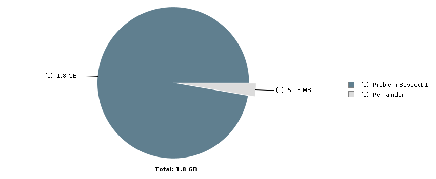

# 덤프 분석 보고서

## 1. 기본정보

| 항목 | 값 |
|---|---|
| 부처명 | 통계청 |
| 업무명 | Aonfine |
| 호스트명 | JHW_WAS01 |
| 요청자 | 미제공 |
| 원본 파일 | aonfine_20260910.tar.gz |
| 덤프 ID | 76ed19f7-42e3-4016-b96e-c78cf839fbcb |
| 보고서 생성일 | 2026-09-10 09:40 KST |

## 2. 증상

사용자가 입력한 증상 설명이 제공되지 않았습니다. (업로드 시 별도로 수집되지 않음)

## 3. 덤프별 분석

### 3.1. ./aonfine_20260910/java_pid_20260909134940.hprof (HEAP)

#### Heap Dump Overview

| 항목 | 값 |
|---|---|
| Used heap dump | 1.8 GB |
| Number of objects | 1,154,277 |
| Number of classes | 23,960 |
| Number of class loaders | 535 |
| Number of GC roots | 3,517 |
| Format | hprof |
| JVM version | openjdk version "1.8.0_352" OpenJDK Runtime Environment (1.8.0_352-b08) OpenJDK 64-Bit Server VM (build 25.352-b08, mixed mode) |
| Time | 2:51:20 AM KST |
| Date | Sep 10, 2026 |
| Identifier size | 64-bit |
| Compressed object pointers | true |
| File path | /DATA/Work/attempts/9c389102-75b3-4825-8248-753fe9f34e04/extract/./aonfine_20260910/java_pid_20260909134940.hprof |
| File length | 2,015,177,510 |
| Total: 13 entries |  |



*Heap Dump Overview -- ./aonfine_20260910/java_pid_20260909134940.hprof -- MAT(Eclipse Memory Analyzer)이 실제 분석 결과로 직접 생성한 그래프입니다.*

#### Problem Suspect 1 (./aonfine_20260910/java_pid_20260909134940.hprof#ProblemSuspect1)

- 점유 주체: java.lang.Thread @ 0x83082070 default task-4
- 스레드명: default task-4
- Retained Size: 1,910,552,880 bytes (1.78 GB) (97.25%)
- 누적 지점 클래스: java.lang.Object[] -- 1,910,542,048 bytes (1.78 GB) (97.25%)

주요 스택 프레임(MAT 추출):

```text
com.aonfine.common.diagnostics.HeapExhaustion.trigger()V (HeapExhaustion.java:15) java.util.ArrayList @ 0xd10c5c20 retains 1,910,542,072 (97.25%) bytes
```

실행 스택(전체, MAT 추출):

```text
default task-4
  at java.lang.OutOfMemoryError.<init>()V (OutOfMemoryError.java:48)
  at com.aonfine.common.diagnostics.HeapExhaustion.trigger()V (HeapExhaustion.java:15)
  at com.aonfine.common.diagnostics.OomTestController.trigger(Ljava/lang/String;Ljavax/servlet/http/HttpServletRequest;Ljavax/servlet/http/HttpServletResponse;)V (OomTestController.java:40)
  at sun.reflect.NativeMethodAccessorImpl.invoke0(Ljava/lang/reflect/Method;Ljava/lang/Object;[Ljava/lang/Object;)Ljava/lang/Object; (NativeMethodAccessorImpl.java(Native Method))
  at sun.reflect.NativeMethodAccessorImpl.invoke(Ljava/lang/Object;[Ljava/lang/Object;)Ljava/lang/Object; (NativeMethodAccessorImpl.java:62)
  at sun.reflect.DelegatingMethodAccessorImpl.invoke(Ljava/lang/Object;[Ljava/lang/Object;)Ljava/lang/Object; (DelegatingMethodAccessorImpl.java:43)
  at java.lang.reflect.Method.invoke(Ljava/lang/Object;[Ljava/lang/Object;)Ljava/lang/Object; (Method.java:498)
  at org.springframework.web.method.support.InvocableHandlerMethod.doInvoke([Ljava/lang/Object;)Ljava/lang/Object; (InvocableHandlerMethod.java:205)
  at org.springframework.web.method.support.InvocableHandlerMethod.invokeForRequest(Lorg/springframework/web/context/request/NativeWebRequest;Lorg/springframework/web/method/support/ModelAndViewContainer;[Ljava/lang/Object;)Ljava/lang/Object; (InvocableHandlerMethod.java:150)
  at org.springframework.web.servlet.mvc.method.annotation.ServletInvocableHandlerMethod.invokeAndHandle(Lorg/springframework/web/context/request/ServletWebRequest;Lorg/springframework/web/method/support/ModelAndViewContainer;[Ljava/lang/Object;)V (ServletInvocableHandlerMethod.java:117)
  at org.springframework.web.servlet.mvc.method.annotation.RequestMappingHandlerAdapter.invokeHandlerMethod(Ljavax/servlet/http/HttpServletRequest;Ljavax/servlet/http/HttpServletResponse;Lorg/springframework/web/method/HandlerMethod;)Lorg/springframework/web/servlet/ModelAndView; (RequestMappingHandlerAdapter.java:895)
  at org.springframework.web.servlet.mvc.method.annotation.RequestMappingHandlerAdapter.handleInternal(Ljavax/servlet/http/HttpServletRequest;Ljavax/servlet/http/HttpServletResponse;Lorg/springframework/web/method/HandlerMethod;)Lorg/springframework/web/servlet/ModelAndView; (RequestMappingHandlerAdapter.java:808)
  at org.springframework.web.servlet.mvc.method.AbstractHandlerMethodAdapter.handle(Ljavax/servlet/http/HttpServletRequest;Ljavax/servlet/http/HttpServletResponse;Ljava/lang/Object;)Lorg/springframework/web/servlet/ModelAndView; (AbstractHandlerMethodAdapter.java:87)
  at org.springframework.web.servlet.DispatcherServlet.doDispatch(Ljavax/servlet/http/HttpServletRequest;Ljavax/servlet/http/HttpServletResponse;)V (DispatcherServlet.java:1072)
  at org.springframework.web.servlet.DispatcherServlet.doService(Ljavax/servlet/http/HttpServletRequest;Ljavax/servlet/http/HttpServletResponse;)V (DispatcherServlet.java:965)
  at org.springframework.web.servlet.FrameworkServlet.processRequest(Ljavax/servlet/http/HttpServletRequest;Ljavax/servlet/http/HttpServletResponse;)V (FrameworkServlet.java:1006)
  at org.springframework.web.servlet.FrameworkServlet.doPost(Ljavax/servlet/http/HttpServletRequest;Ljavax/servlet/http/HttpServletResponse;)V (FrameworkServlet.java:909)
  at javax.servlet.http.HttpServlet.service(Ljavax/servlet/http/HttpServletRequest;Ljavax/servlet/http/HttpServletResponse;)V (HttpServlet.java:523)
  at org.springframework.web.servlet.FrameworkServlet.service(Ljavax/servlet/http/HttpServletRequest;Ljavax/servlet/http/HttpServletResponse;)V (FrameworkServlet.java:883)
  at javax.servlet.http.HttpServlet.service(Ljavax/servlet/ServletRequest;Ljavax/servlet/ServletResponse;)V (HttpServlet.java:590)
  at io.undertow.servlet.handlers.ServletHandler.handleRequest(Lio/undertow/server/HttpServerExchange;)V (ServletHandler.java:74)
  at io.undertow.servlet.handlers.FilterHandler$FilterChainImpl.doFilter(Ljavax/servlet/ServletRequest;Ljavax/servlet/ServletResponse;)V (FilterHandler.java:129)
  at org.springframework.web.filter.CharacterEncodingFilter.doFilterInternal(Ljavax/servlet/http/HttpServletRequest;Ljavax/servlet/http/HttpServletResponse;Ljavax/servlet/FilterChain;)V (CharacterEncodingFilter.java:201)
  at org.springframework.web.filter.OncePerRequestFilter.doFilter(Ljavax/servlet/ServletRequest;Ljavax/servlet/ServletResponse;Ljavax/servlet/FilterChain;)V (OncePerRequestFilter.java:117)
  at io.undertow.servlet.core.ManagedFilter.doFilter(Ljavax/servlet/ServletRequest;Ljavax/servlet/ServletResponse;Ljavax/servlet/FilterChain;)V (ManagedFilter.java:67)
  at io.undertow.servlet.handlers.FilterHandler$FilterChainImpl.doFilter(Ljavax/servlet/ServletRequest;Ljavax/servlet/ServletResponse;)V (FilterHandler.java:131)
  at io.undertow.servlet.handlers.FilterHandler.handleRequest(Lio/undertow/server/HttpServerExchange;)V (FilterHandler.java:84)
  at io.undertow.servlet.handlers.security.ServletSecurityRoleHandler.handleRequest(Lio/undertow/server/HttpServerExchange;)V (ServletSecurityRoleHandler.java:62)
  at io.undertow.servlet.handlers.ServletChain$1.handleRequest(Lio/undertow/server/HttpServerExchange;)V (ServletChain.java:68)
  at io.undertow.servlet.handlers.ServletDispatchingHandler.handleRequest(Lio/undertow/server/HttpServerExchange;)V (ServletDispatchingHandler.java:36)
  at org.wildfly.extension.undertow.security.SecurityContextAssociationHandler.handleRequest(Lio/undertow/server/HttpServerExchange;)V (SecurityContextAssociationHandler.java:78)
  at io.undertow.server.handlers.PredicateHandler.handleRequest(Lio/undertow/server/HttpServerExchange;)V (PredicateHandler.java:43)
  at io.undertow.servlet.handlers.RedirectDirHandler.handleRequest(Lio/undertow/server/HttpServerExchange;)V (RedirectDirHandler.java:68)
  at io.undertow.servlet.handlers.security.SSLInformationAssociationHandler.handleRequest(Lio/undertow/server/HttpServerExchange;)V (SSLInformationAssociationHandler.java:117)
  at io.undertow.servlet.handlers.security.ServletAuthenticationCallHandler.handleRequest(Lio/undertow/server/HttpServerExchange;)V (ServletAuthenticationCallHandler.java:57)
  at io.undertow.server.handlers.PredicateHandler.handleRequest(Lio/undertow/server/HttpServerExchange;)V (PredicateHandler.java:43)
  at io.undertow.security.handlers.AbstractConfidentialityHandler.handleRequest(Lio/undertow/server/HttpServerExchange;)V (AbstractConfidentialityHandler.java:46)
  at io.undertow.servlet.handlers.security.ServletConfidentialityConstraintHandler.handleRequest(Lio/undertow/server/HttpServerExchange;)V (ServletConfidentialityConstraintHandler.java:64)
  at io.undertow.security.handlers.AuthenticationMechanismsHandler.handleRequest(Lio/undertow/server/HttpServerExchange;)V (AuthenticationMechanismsHandler.java:60)
  at io.undertow.servlet.handlers.security.CachedAuthenticatedSessionHandler.handleRequest(Lio/undertow/server/HttpServerExchange;)V (CachedAuthenticatedSessionHandler.java:77)
  at io.undertow.security.handlers.NotificationReceiverHandler.handleRequest(Lio/undertow/server/HttpServerExchange;)V (NotificationReceiverHandler.java:50)
  at io.undertow.security.handlers.AbstractSecurityContextAssociationHandler.handleRequest(Lio/undertow/server/HttpServerExchange;)V (AbstractSecurityContextAssociationHandler.java:43)
  at io.undertow.server.handlers.PredicateHandler.handleRequest(Lio/undertow/server/HttpServerExchange;)V (PredicateHandler.java:43)
  at org.wildfly.extension.undertow.security.jacc.JACCContextIdHandler.handleRequest(Lio/undertow/server/HttpServerExchange;)V (JACCContextIdHandler.java:61)
  at io.undertow.server.handlers.PredicateHandler.handleRequest(Lio/undertow/server/HttpServerExchange;)V (PredicateHandler.java:43)
  at org.wildfly.extension.undertow.deployment.GlobalRequestControllerHandler.handleRequest(Lio/undertow/server/HttpServerExchange;)V (GlobalRequestControllerHandler.java:68)
  at io.undertow.servlet.handlers.SendErrorPageHandler.handleRequest(Lio/undertow/server/HttpServerExchange;)V (SendErrorPageHandler.java:52)
  at io.undertow.server.handlers.PredicateHandler.handleRequest(Lio/undertow/server/HttpServerExchange;)V (PredicateHandler.java:43)
  at io.undertow.servlet.handlers.ServletInitialHandler.handleFirstRequest(Lio/undertow/server/HttpServerExchange;Lio/undertow/servlet/handlers/ServletRequestContext;)V (ServletInitialHandler.java:275)
  at io.undertow.servlet.handlers.ServletInitialHandler.access$100(Lio/undertow/servlet/handlers/ServletInitialHandler;Lio/undertow/server/HttpServerExchange;Lio/undertow/servlet/handlers/ServletRequestContext;)V (ServletInitialHandler.java:79)
  at io.undertow.servlet.handlers.ServletInitialHandler$2.call(Lio/undertow/server/HttpServerExchange;Lio/undertow/servlet/handlers/ServletRequestContext;)Ljava/lang/Object; (ServletInitialHandler.java:134)
  at io.undertow.servlet.handlers.ServletInitialHandler$2.call(Lio/undertow/server/HttpServerExchange;Ljava/lang/Object;)Ljava/lang/Object; (ServletInitialHandler.java:131)
  at io.undertow.servlet.core.ServletRequestContextThreadSetupAction$1.call(Lio/undertow/server/HttpServerExchange;Ljava/lang/Object;)Ljava/lang/Object; (ServletRequestContextThreadSetupAction.java:48)
  at io.undertow.servlet.core.ContextClassLoaderSetupAction$1.call(Lio/undertow/server/HttpServerExchange;Ljava/lang/Object;)Ljava/lang/Object; (ContextClassLoaderSetupAction.java:43)
  at org.wildfly.extension.undertow.security.SecurityContextThreadSetupAction.lambda$create$0(Lio/undertow/servlet/api/ThreadSetupHandler$Action;Lio/undertow/server/HttpServerExchange;Ljava/lang/Object;)Ljava/lang/Object; (SecurityContextThreadSetupAction.java:105)
  at org.wildfly.extension.undertow.security.SecurityContextThreadSetupAction$$Lambda$1404.call(Lio/undertow/server/HttpServerExchange;Ljava/lang/Object;)Ljava/lang/Object; ()
  at org.wildfly.extension.undertow.deployment.UndertowDeploymentInfoService$UndertowThreadSetupAction.lambda$create$0(Lio/undertow/servlet/api/ThreadSetupHandler$Action;Lio/undertow/server/HttpServerExchange;Ljava/lang/Object;)Ljava/lang/Object; (UndertowDeploymentInfoService.java:1555)
  at org.wildfly.extension.undertow.deployment.UndertowDeploymentInfoService$UndertowThreadSetupAction$$Lambda$1405.call(Lio/undertow/server/HttpServerExchange;Ljava/lang/Object;)Ljava/lang/Object; ()
  at org.wildfly.extension.undertow.deployment.UndertowDeploymentInfoService$UndertowThreadSetupAction.lambda$create$0(Lio/undertow/servlet/api/ThreadSetupHandler$Action;Lio/undertow/server/HttpServerExchange;Ljava/lang/Object;)Ljava/lang/Object; (UndertowDeploymentInfoService.java:1555)
  at org.wildfly.extension.undertow.deployment.UndertowDeploymentInfoService$UndertowThreadSetupAction$$Lambda$1405.call(Lio/undertow/server/HttpServerExchange;Ljava/lang/Object;)Ljava/lang/Object; ()
  at org.wildfly.extension.undertow.deployment.UndertowDeploymentInfoService$UndertowThreadSetupAction.lambda$create$0(Lio/undertow/servlet/api/ThreadSetupHandler$Action;Lio/undertow/server/HttpServerExchange;Ljava/lang/Object;)Ljava/lang/Object; (UndertowDeploymentInfoService.java:1555)
  at org.wildfly.extension.undertow.deployment.UndertowDeploymentInfoService$UndertowThreadSetupAction$$Lambda$1405.call(Lio/undertow/server/HttpServerExchange;Ljava/lang/Object;)Ljava/lang/Object; ()
  at org.wildfly.extension.undertow.deployment.UndertowDeploymentInfoService$UndertowThreadSetupAction.lambda$create$0(Lio/undertow/servlet/api/ThreadSetupHandler$Action;Lio/undertow/server/HttpServerExchange;Ljava/lang/Object;)Ljava/lang/Object; (UndertowDeploymentInfoService.java:1555)
  at org.wildfly.extension.undertow.deployment.UndertowDeploymentInfoService$UndertowThreadSetupAction$$Lambda$1405.call(Lio/undertow/server/HttpServerExchange;Ljava/lang/Object;)Ljava/lang/Object; ()
  at io.undertow.servlet.handlers.ServletInitialHandler.dispatchRequest(Lio/undertow/server/HttpServerExchange;Lio/undertow/servlet/handlers/ServletRequestContext;Lio/undertow/servlet/handlers/ServletChain;Ljavax/servlet/DispatcherType;)V (ServletInitialHandler.java:255)
  at io.undertow.servlet.handlers.ServletInitialHandler.access$000(Lio/undertow/servlet/handlers/ServletInitialHandler;Lio/undertow/server/HttpServerExchange;Lio/undertow/servlet/handlers/ServletRequestContext;Lio/undertow/servlet/handlers/ServletChain;Ljavax/servlet/DispatcherType;)V (ServletInitialHandler.java:79)
  at io.undertow.servlet.handlers.ServletInitialHandler$1.handleRequest(Lio/undertow/server/HttpServerExchange;)V (ServletInitialHandler.java:100)
  at io.undertow.server.Connectors.executeRootHandler(Lio/undertow/server/HttpHandler;Lio/undertow/server/HttpServerExchange;)V (Connectors.java:393)
  at io.undertow.server.HttpServerExchange$1.run()V (HttpServerExchange.java:852)
  at org.jboss.threads.ContextClassLoaderSavingRunnable.run()V (ContextClassLoaderSavingRunnable.java:35)
  at org.jboss.threads.EnhancedQueueExecutor.safeRun(Ljava/lang/Runnable;)V (EnhancedQueueExecutor.java:1990)
  at org.jboss.threads.EnhancedQueueExecutor$ThreadBody.doRunTask(Ljava/lang/Runnable;)V (EnhancedQueueExecutor.java:1486)
  at org.jboss.threads.EnhancedQueueExecutor$ThreadBody.run()V (EnhancedQueueExecutor.java:1377)
  at org.xnio.XnioWorker$WorkerThreadFactory$1$1.run()V (XnioWorker.java:1282)
  at java.lang.Thread.run()V (Thread.java:750)
```

## 4. 결론 및 권고

## 결론 및 권고

**결론**

`java_pid_20260909134940.hprof` 덤프 분석 결과, `ProblemSuspect1`(스레드 `default task-4`)가 전체 힙의 **97.25%(1,910,552,880 bytes)**를 점유하고 있으며, 누적 지점(accumulation point)은 `java.lang.Object[]`(1,910,542,048 bytes, 97.25%)로 지목되었습니다. 스택 트레이스상 누적 경로는 `com.aonfine.common.diagnostics.HeapExhaustion.trigger()V (HeapExhaustion.java:15)` → `com.aonfine.common.diagnostics.OomTestController.trigger(...)` (OomTestController.java:40)이며, `java.util.ArrayList @ 0xd10c5c20`가 1,910,542,072 bytes(97.25%)를 보유하고 있습니다.

서버 로그(`server.log`)에서도 동일 스레드(`default task-4`)에서 다음이 확인됩니다.

- `2026-09-09 13:51:11,371 WARN [com.aonfine.common.diagnostics.OomTestController] (default task-4) Intentional OOM test started: allocating heap in the application JVM`
- `2026-09-09 13:52:09,718 ERROR [io.undertow.request] (default task-4) UT005023: Exception handling request to /AonFine/diagnostics/oom.do: ... java.lang.OutOfMemoryError: Java heap space`

로그 문구(`Intentional OOM test started`)와 클래스/패키지명(`OomTestController`, `HeapExhaustion`)을 종합하면, 이번 OOM은 실제 업무 로직상의 메모리 누수라기보다 **`/AonFine/diagnostics/oom.do` 엔드포인트를 통한 의도적(진단/테스트용) 힙 소진 유발 코드**에 의한 것으로 판단됩니다. 다만 해당 컨트롤러/클래스가 운영 환경에 상시 배포되어 있는지, 테스트 목적으로만 존재하는지는 EVIDENCE만으로는 확인할 수 없어 **추가 확인이 필요**합니다.

VM 옵션 로그에 따르면 `-Xms2048m -Xmx2048m`(힙 2GB 고정)이며, 힙 덤프 사용량은 1.8GB로 보고되어 있어 해당 시점에 힙 상한에 근접/도달했을 개연성이 있습니다. 단, 정확한 OOM 발생 시각과 덤프 생성 시각의 인과관계, GC 로그상의 상세 추이는 EVIDENCE에 포함되어 있지 않아 **근거 부족**입니다.

**권고**

1. `com.aonfine.common.diagnostics.OomTestController`(`/AonFine/diagnostics/oom.do`) 및 `HeapExhaustion.trigger()` 코드가 운영(prod) 환경에 노출되어 있는지 점검 권고. 진단/테스트 목적 코드라면 운영 배포에서 제외하거나 접근 제어(인증/방화벽 등)를 적용할 것을 권고합니다.
2. 해당 엔드포인트가 외부에서 호출 가능한 상태였는지, 의도치 않은 반복 호출(스캐너, 배치, 악의적 호출 등)로 인해 OOM이 유발되었는지 확인 권고. 로그상 호출 시각(13:51:11)과 OOM 발생(13:52:09) 간 약 1분의 간격이 있어, 요청 1건으로 인한 즉시 소진인지 반복 호출에 의한 누적 소진인지는 추가 로그(같은 시간대의 다른 요청 이력) 확인이 필요합니다.
3. 현재 힙 설정(`-Xmx2048m`)이 해당 애플리케이션의 정상 부하를 감당하기에 충분한지 별도로 재검토하되, 이번 사례는 의도적 테스트 코드에 의한 소진 정황이 강하므로 힙 증설보다는 **해당 진단 기능의 운영 환경 존재 여부 및 접근 통제 점검을 우선** 권고합니다.
4. 향후 유사 현상 재발 시, GC 로그(`/GCLOUD/JBOSS/LOG/AP_name10/gclog/gc_20260909134940.log`)와 스레드 덤프를 함께 확보하여 실제 애플리케이션 로직에 의한 누수인지, 이번과 같은 진단성 코드에 의한 것인지 구분할 수 있도록 점검 절차를 마련할 것을 권고합니다.

**참고사항**: 본 덤프(`./aonfine_20260910/java_pid_20260909134940.hprof`) 외 다른 덤프나 추가 Problem Suspect는 EVIDENCE에 존재하지 않아 비교 분석은 수행하지 않았습니다.

## 5. 근거 파일 참조

- evidence/evidence.json: 이 보고서 작성에 사용된 전체 구조화 근거 데이터
- ./aonfine_20260910/java_pid_20260909134940.hprof (HEAP)
- server.log (서버 로그)

